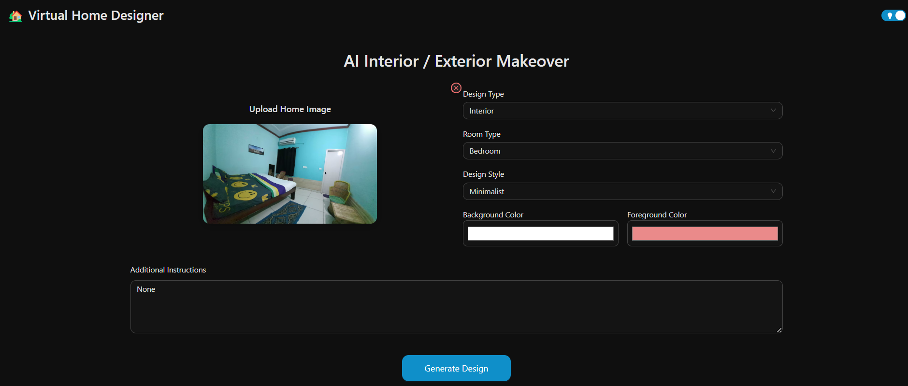
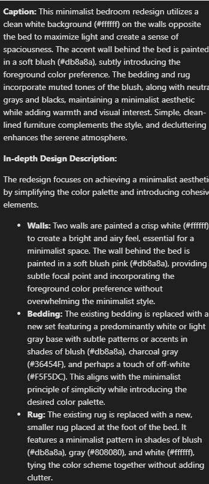
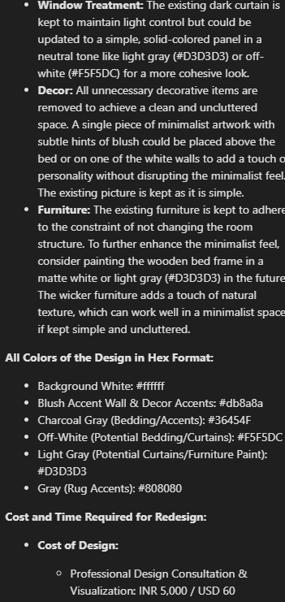
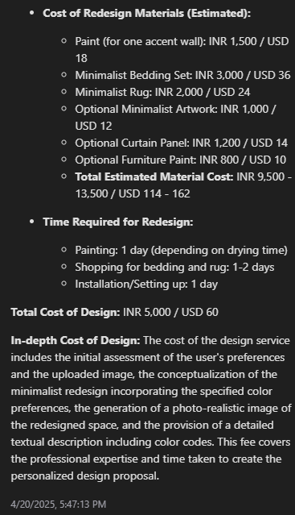

# 🏡 Gen AI Home Interior Designer

A powerful Gen AI-powered home redesign tool that transforms real-world room or outdoor images into beautifully reimagined interiors or exteriors. Leveraging Google Gemini (Multimodal Generative AI) and FastAPI, this virtual designer allows users to upload a space photo, select design preferences (room type, style, colors), and instantly receive a photorealistic redesign with cost estimation and improvement suggestions.
Perfect for real estate visualization, interior decorators, home remodeling inspiration, and furniture retailers.

---

## 🚀 Features

- Upload any **room or outdoor space image**
- Choose **interior** or **exterior**, room type, style, and color preferences
- Receive an **AI-generated redesign** of the space
- Text description includes **style breakdown, design logic, and cost/time estimate**
- Preserves spatial structure while changing layout/design
- **Dark/Light mode** toggle for accessibility
- Scrollable **result preview** and **session-based history**

---

## 🖼️ Screenshots







---

## 🛠️ Tech Stack

| 🖥️ Frontend           | ⚙️ Backend       | 🤖 AI & Processing       |
|------------------------|------------------|--------------------------|
| React.js               | FastAPI          | Google Gemini API (Generative AI) |
| Ant Design             | Uvicorn (ASGI)   | Image-to-Image Prompt + Inference |
| Axios                  | Python 3.12+     | Base64 Encoding/Decoding |
| React Toastify         | Pydantic         | Multimodal Content Handling |

---

## ⚙️ Setup Instructions

### 1. Clone the Repo

```bash
git clone https://github.com/narender-rk10/Gen-AI-Home-Interior-Designer.git
cd Gen-AI-Home-Interior-Designer
```

### 2. Setup Backend

```bash
cd backend
poetry install
poetry shell
```

Create a `.env` file in the backend folder and add your Gemini API key:

```
GEMINI_API_KEY=your_gemini_api_key_here
```

Run the server:

```bash
uvicorn main:app --reload
```

### 3. Setup Frontend

```bash
cd frontend
npm install
npm run dev
```

---

## 📦 API Endpoint

```
POST /api/try-on
```

### Accepts `multipart/form-data`:

| Field           | Type        | Description                                  |
|----------------|-------------|----------------------------------------------|
| `place_image`   | File        | Room or space image to redesign              |
| `design_type`   | String      | interior / exterior                          |
| `room_type`     | String      | living / bedroom / kitchen / etc.            |
| `style`         | String      | modern / rustic / boho / etc.                |
| `background_color` | String  | HEX color code                               |
| `foreground_color` | String  | HEX color code                               |
| `instructions`  | String (optional) | Additional user notes for design AI     |

---

## 📁 Project Structure

```
/frontend       # React + Ant Design frontend UI
/backend        # FastAPI backend with Gemini integration
```

---

## 🤝 Contributing

Pull requests are welcome! If you have suggestions for new design types, prompt enhancements, or UI improvements — feel free to fork and contribute.

---

## 📄 LICENSE

<a rel="license" href="http://creativecommons.org/licenses/by-nc-nd/4.0/">
  
</a>
<br />
This work is licensed under a 
<a rel="license" href="http://creativecommons.org/licenses/by-nc-nd/4.0/">
  Creative Commons Attribution-NonCommercial-NoDerivatives 4.0 International License
</a>.

---

## 💡 Inspiration

This project showcases how **multimodal AI** can revolutionize interior design — enabling users to envision complete transformations of their living spaces, instantly and photorealistically.

---

## 🙋‍♂️ Author

**Narender Keswani**  
🔗 [GitHub](https://github.com/narender-rk10) • 💼 [LinkedIn](https://linkedin.com/in/narender-keswani) • 🌐 [Website](https://www.narenderkeswani.com)
